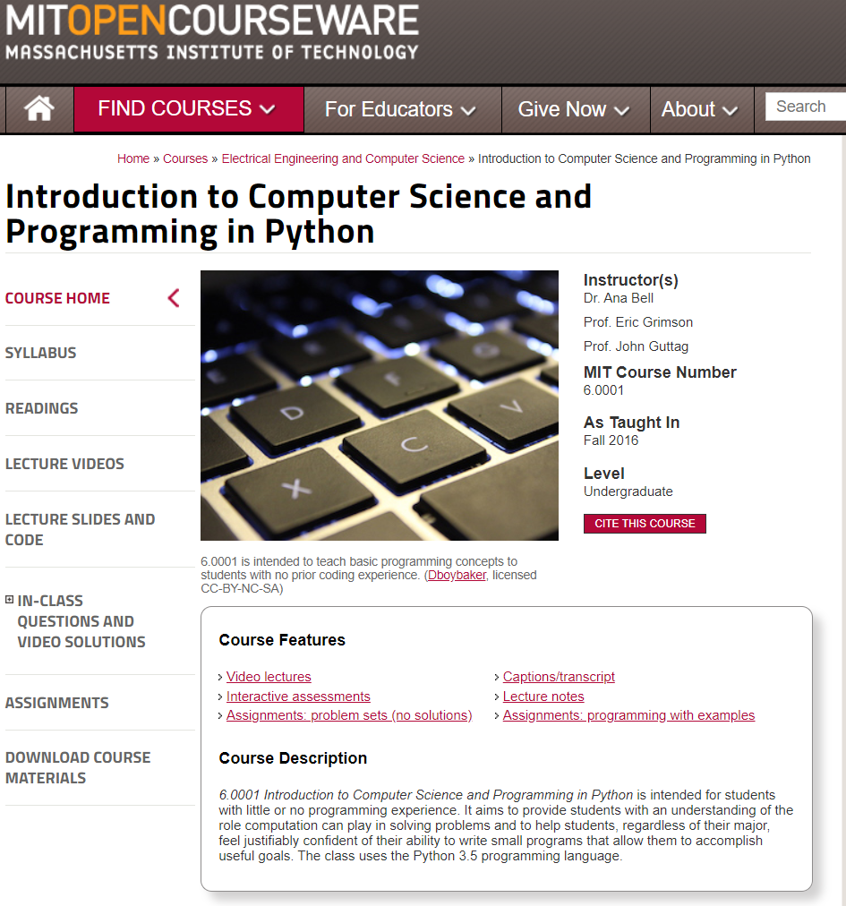

# Introduction to Computer Science and Programming in Python

https://ocw.mit.edu/courses/electrical-engineering-and-computer-science/6-0001-introduction-to-computer-science-and-programming-in-python-fall-2016/index.htm

---

    

---

## SES # - TOPICS ASSIGNMENTS

[1 - What is computation?](https://ocw.mit.edu/courses/electrical-engineering-and-computer-science/6-0001-introduction-to-computer-science-and-programming-in-python-fall-2016/lecture-videos/lecture-1-what-is-computation/)

[2 - Branching and Iteration](https://ocw.mit.edu/courses/electrical-engineering-and-computer-science/6-0001-introduction-to-computer-science-and-programming-in-python-fall-2016/lecture-videos/lecture-2-branching-and-iteration/)

[3 - String Manipulation, Guess and Check, Approximations, Bisection](https://ocw.mit.edu/courses/electrical-engineering-and-computer-science/6-0001-introduction-to-computer-science-and-programming-in-python-fall-2016/lecture-videos/lecture-3-string-manipulation-guess-and-check-approximations-bisection/)

[4 - Decomposition, Abstractions, Functions](https://ocw.mit.edu/courses/electrical-engineering-and-computer-science/6-0001-introduction-to-computer-science-and-programming-in-python-fall-2016/lecture-videos/lecture-4-decomposition-abstraction-and-functions/)

[5 - Tuples, Lists, Aliasing, Mutability, Cloning](https://ocw.mit.edu/courses/electrical-engineering-and-computer-science/6-0001-introduction-to-computer-science-and-programming-in-python-fall-2016/lecture-videos/lecture-5-tuples-lists-aliasing-mutability-and-cloning/)

[6 - Recursion, Dictionaries](https://ocw.mit.edu/courses/electrical-engineering-and-computer-science/6-0001-introduction-to-computer-science-and-programming-in-python-fall-2016/lecture-videos/lecture-6-recursion-and-dictionaries)

[7 - Testing, Debugging, Exceptions, Assertions](https://ocw.mit.edu/courses/electrical-engineering-and-computer-science/6-0001-introduction-to-computer-science-and-programming-in-python-fall-2016/lecture-videos/lecture-7-testing-debugging-exceptions-and-assertions/)

[8 - Object Oriented Programming](https://ocw.mit.edu/courses/electrical-engineering-and-computer-science/6-0001-introduction-to-computer-science-and-programming-in-python-fall-2016/lecture-videos/lecture-8-object-oriented-programming/)

9 - Python Classes and Inheritance

10 - Understanding Program Efficiency, Part 1

11 - Understanding Program Efficiency, Part 2

12 - Searching and Sorting

---

    

